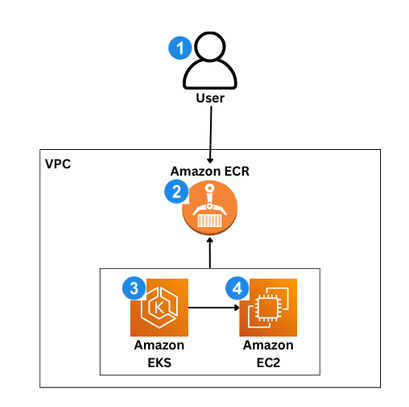
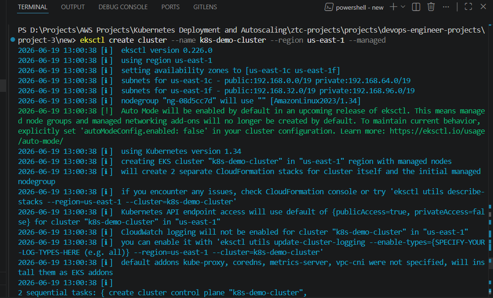
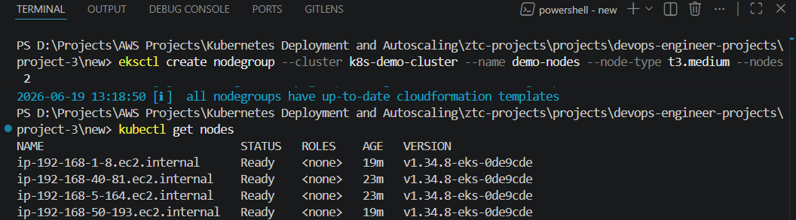
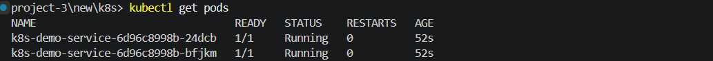
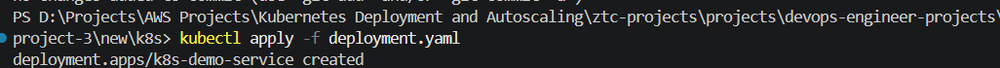
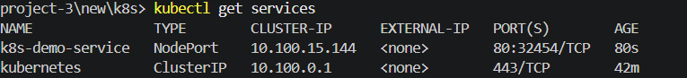
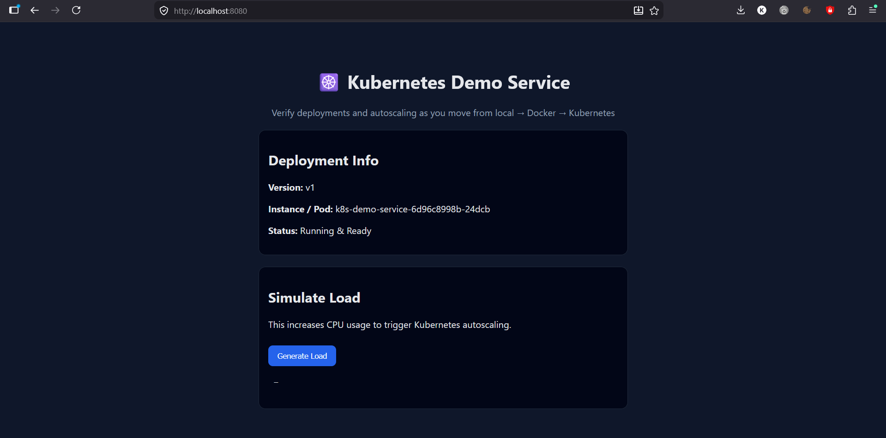

# Kubernetes Deployment And Autoscaling
## 📋 Project Overview

This project demonstrates how to take a simple Node.js backend application and deploy it on a Kubernetes cluster running on **Amazon Elastic Kubernetes Service (EKS)**.

It walks through the full DevOps lifecycle:

* Running the application locally
* Containerizing it using Docker
* Pushing the image to Amazon Elastic Container Registry (ECR)
* Creating a Kubernetes cluster using eksctl
* Deploying the application using Kubernetes Deployments and Services
* Exposing the application using NodePort networking

---

## 🏗️Architecture

The system follows a standard Kubernetes deployment model on AWS:

1. **User** accessess the application endpoint.
2. Container images are stored in **Amazon ECR**.
3. **Amazon EKS** manages the **Kubernetes cluster**.
4. **EC2 worker nodes** run application Pods pulled from **ECR**.



---

## 🛠️ Technologies Used

* Node.js
* Docker
* Kubernetes
* Amazon EKS
* Amazon ECR
* AWS CLI
* eksctl
* kubectl
* Amazon EC2
* Amazon VPC & Security Groups

---

## 📁 Project Structure

```

project-3/
├── app/                 # Node.js application
│   ├── public/
│   ├── src/
│   ├── package.json
│   ├── Dockerfile
│   └── README.md
├── k8s/                 # Kubernetes manifests
│   ├── deployment.yaml
│   └── service.yaml
│
└── README.md

```
## 🚀Key Features

* Containerized Node.js backend application
* Kubernetes Deployment managing multiple replicas
* Kubernetes Service for stable networking and load balancing
* External access via NodePort
* AWS-managed Kubernetes cluster using EKS
* Scalable and fault-tolerant architecture

---

## Step-by-Step Deployment Guide

### 1. Run Application Locally

Install dependencies and run the app:

```bash
npm install
npm start
```

Access:

```
http://localhost:3000
```

---

### 2. Build Docker Image

```bash
docker build --platform linux/amd64 -t k8s-demo-service .
```

Run container locally:

```bash
docker run -p 3000:3000 k8s-demo-service
```

---

### 3. Push Image to Amazon ECR

Create an ECR repository:

```
k8s-demo-service
```

Authenticate Docker:

```bash
aws ecr get-login-password --region us-east-1 | docker login --username AWS --password-stdin <account-id>.dkr.ecr.us-east-1.amazonaws.com
```

Tag image:

```bash
docker tag k8s-demo-service:latest <account-id>.dkr.ecr.us-east-1.amazonaws.com/k8s-demo-service:latest
```

Push image:

```bash
docker push <account-id>.dkr.ecr.us-east-1.amazonaws.com/k8s-demo-service:latest
```

---

### 4. Create EKS Cluster

```bash
eksctl create cluster \
  --name k8s-demo-cluster \
  --region us-east-1 \
  --nodegroup-name demo-nodes \
  --node-type t3.medium \
  --nodes 2
```

Verify nodes:

```bash
kubectl get nodes
```

---

### 5. Deploy Application to Kubernetes

Update `deployment.yaml` with your ECR image:

```yaml
image: <account-id>.dkr.ecr.us-east-1.amazonaws.com/k8s-demo-service:latest
```

Apply deployment:

```bash
kubectl apply -f k8s/deployment.yaml
```

Check pods:

```bash
kubectl get pods
```

---

### 6. Expose Application with Service

```bash
kubectl apply -f k8s/service.yaml
kubectl get services
```


---

### 7. Access the Application

Confirm the application works internally using port forwarding:

```
kubectl port-forward deployment/k8s-demo-service 8080:3000
```
Access:

```
http://localhost:8080
```

---

## Networking Flow

1. User sends request to NodePort
2. EC2 worker node receives traffic
3. Kubernetes Service routes request
4. Traffic is load-balanced across Pods
5. Application responds from one of the running containers

---

## Key Concepts Learned

* How containers are built and executed using Docker
* How Kubernetes manages Pods and Deployments
* How Services expose applications inside and outside the cluster
* How Amazon EKS abstracts Kubernetes control plane management
* How real-world cloud networking works with NodePort and Security Groups

---

## 🏆 Challenges Solved

* Bridging local development to cloud deployment
* Understanding image registry requirements (ECR vs local Docker)
* Configuring Kubernetes manifests correctly
* Handling AWS networking and security group rules
* Connecting kubectl to a remote EKS cluster

---

## 💡 What I Learned

* End-to-end Kubernetes deployment workflow on AWS
* Difference between containerization and orchestration
* Real-world DevOps tooling (eksctl, kubectl, AWS CLI)
* How traffic flows inside Kubernetes clusters
* Importance of infrastructure-as-code mindset in deployments

---

## Future Improvements

* Add Ingress Controller for HTTPS routing
* Implement Horizontal Pod Autoscaler (HPA)
* Add CI/CD pipeline (GitHub Actions or AWS CodePipeline)
* Use Terraform to fully automate infrastructure

---

## 🤝 Connect With Me

<p align="center">
<a href="mailto:knokwaku99@gmail.com">

</a>

<a href="https://www.linkedin.com/in/knosei/">

</a>
</p>

---
